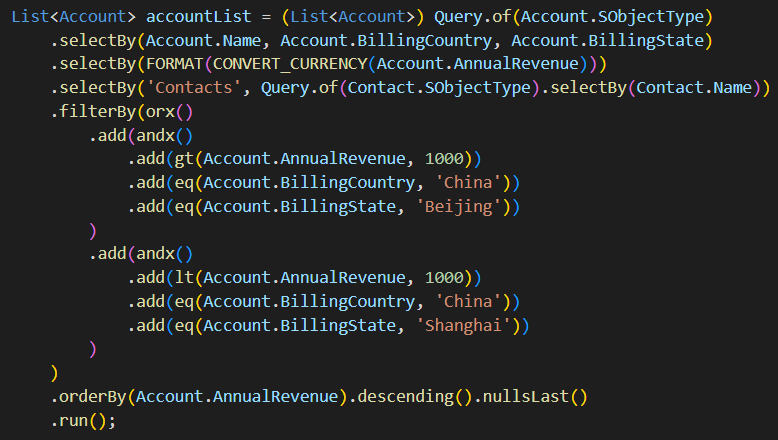

# Apex Query

  

An apex SOQL query builder to dynamically build SOQL supporting almost all syntaxes.

| Environment           | Installation Link                                            | Version |
| --------------------- | ------------------------------------------------------------ | ------- |
| Production, Developer | <a target="_blank" href="https://login.salesforce.com/packaging/installPackage.apexp?p0=04t2v000007CfgQAAS"></a> | ver 1.0 |
| Sandbox               | <a target="_blank" href="https://test.salesforce.com/packaging/installPackage.apexp?p0=04t2v000007CfgQAAS"></a> | ver 1.0 |

---

### v1.0 Release Notes

---

## Table of Contents


## 1. Design Principles

1. **Highly Composable**: Select, where, order by and group by clauses can be create standalone elsewhere. They can be passed around, modified, and composed into queries later in the code.

2. **Highly Compatible**: Support all syntaxes and features of SOQL, except the following features as of current state: 

   - `TYPEOF` statement.
   - `USING SCOPE` statement.
   - `WITH [DATA CATEGORY]` statement.

3. **Value Objects**: Queries and all clauses are value objects, which means different query instances are considered equal when built with same parameters.

   ```java
   // Queries for the same sObject and with same fields selected in the same order
   Assert.areEqual(
       Query.of(Account.SObjectType).selectBy(Account.Id, Account.Name)),
       Query.of(Account.SObjectType).selectBy(Account.Id, Account.Name))
   );
   ```

4. **Strong Types**: Strong types are enforced when possible, so developers can make less mistakes when construct queries.

   ````java
   // Example 1: date function can only be compared with an Integer.
   qt(CALENDAR_MONTH(Contact.Birthdate), 1);   // pass
   qt(CALENDAR_MONTH(Contact.Birthdate), 'A'); // fail
   ````

   

## 2. Naming Conventions

<p align="center">
    
</p>


### 2.1 Readability

Here are the naming conventions to increase query readability:

|               | Description                                                  | Naming Convention | Reasoning                                                    | Examples                                                     |
| ------------- | ------------------------------------------------------------ | ----------------- | ------------------------------------------------------------ | ------------------------------------------------------------ |
| **Keywords**  | These are backbone structures of a SOQL.                     | camelCase         | Keywords should easily remind users to their SOQL counterparts. | `selectBy`, `filterBy`, `groupBy`, `havingBy`, `orderBy`     |
| **Operators** | These are mainly logic and comparison operators.             | lower case        | Operators should be small and short to be operator-like, therefore MongoDB operators are used. | `eq`, `ne`, `gt`, `gte`, `lt`, `lte`, `inx`, `nin`           |
| **Functions** | These are used to perform aggregation, formatting, and date accessing etc. | UPPER_CASE        | This gives best readability, because it can be easily noticed when appear among many lower cases from field names, keywords and operators. | `COUNT`, `MAX`, `TO_LABEL`, `FORMAT`, `CALENDAR_MONTH`, `FISCAL_YEAR` |
| **Literals**  | These are mainly date and currency literals.                 | UPPER_CASE        | Those are constant-like values, so static constant variable naming convention is preferred. | `LAST_90_DAYS()`, `LAST_N_DAYS(30)`, `USD(100)`, `CYN(888)`  |

### 2.2 Confliction

Here are the naming conventions to avoid conflictions with existing keywords or operators.

1.  Use `<keyword>By()` format for SOQL keywords, such as `selectBy`, `filterBy`, `groupBy`, `havingBy`, `orderBy`.
2. Use `<operator>x()` format for conflicted operators only, such as `orx()`, `andx()`, `inx()`, `likex()`. No need to memorize when to follow, the IDE will highlight there is a confliction, then you will know its time to add the x as suffix.  

## 3. Overview

### 3.1 Query Class

When possible, your classes can extend the `Query` class before using it to build queries. Because it gives advantages to not need add `Query` dot before all the static operators, functions and literals in order to reference them.

```java
public with sharing class AccountSelector extends Query {
    
}
```

Otherwise you have to add `Query` dot before them as the example below, which doesn't look bad anyway. All examples are default written in a class extending the `Query`, except noticed.

```java
List<Account> accountList = (List<Account>) Query.of(Account.SObjectType)
    .selectBy(Account.Name, Account.BillingCountry, Account.BillingState)
    .selectBy(Query.FORMAT(Query.CONVERT_CURRENCY(Account.AnnualRevenue), Query.TO_LABEL(AccountSource))
    .selectBy('Contacts', Query.of(Contact.SObjectType).selectBy(Contact.Name))
    .filterBy(Query.orx()
        .add(Query.andx()
            .add(Query.gt(Account.AnnualRevenue, 1000))
            .add(Query.eq(Account.BillingCountry, 'China'))
            .add(Query.eq(Account.BillingState, 'Beijing'))
        )
        .add(Query.andx()
            .add(Query.lt(Account.AnnualRevenue, 1000))
            .add(Query.eq(Account.BillingCountry, 'China'))
            .add(Query.eq(Account.BillingState, 'Shanghai'))
        )
    )
    .orderBy(Account.AnnualRevenue).descending().nullsLast()
    .run();
```

### 3.2 Chaining Order

The chaining order of an query doesn't have to be in the order as they defined in the SOQL, when executed each clause will be under its correct order. This gives advantages when query is built in multi-places.

## 4. Keywords

There is no SOQL `from ` keyword counterpart, the from is implied when create a Query with the `of` API:

```java
Query query = Query.of(Account.SOBjectType)
```

### 4.1 Select Statement

There three types of `selectBy()` statements:

1. Accept only `SObjectField` as parameters, such as: `Account.Name`
2. Accept only functions as parameters, such as: `MAX(Account.AnnualRevenel)`
3. Accept subquery as parameter.

```java
Query query = Query.of(Account.SObjectType)
    // #1. all params are fields
    .selectBy(Account.Name, Account.BillingCountry, Account.BillingState)
    // #2. all params are functions
    .selectBy(Query.FORMAT(Query.CONVERT_CURRENCY(Account.AnnualRevenue), Query.TO_LABEL(AccountSource))
    // #3. one subqueries for child relationship "Contacts"
    .selectBy('Contacts', Query.of(Contact.SObjectType).selectBy(Contact.Name));
```

There can be as many `selectBy()` as needed to chain together

4.2 Select Statement


